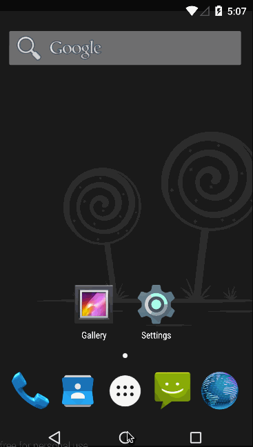

# Week 1 Project : Instagram Photo Viewer

Android application to display popular photos from Instagram API. Retrieve popular photos using these
 2 endpoints : 
 
 * [Media Popular](https://instagram.com/developer/endpoints/media/#get_media_popular)
 * [Comments](https://instagram.com/developer/endpoints/comments/#get_media_comments)

Time spent : __7 hours__

### User story completed : ###

* __Required__ : user can scroll through current popular photos
* __Required__ : on each photo, display: graphic, caption, username, relative timestamp, like count and user profile image
* __Optional__ : Add pull to refresh display
* __Optional__ : Show last 2 comments
* __Optional__ : Display user profile image with RoundedImageView
* __Optional__ : Show default placeholder graphic
* __Optional__ : Display image in the same proportional
* __Bonus__    : show all comments through dialog fragment

